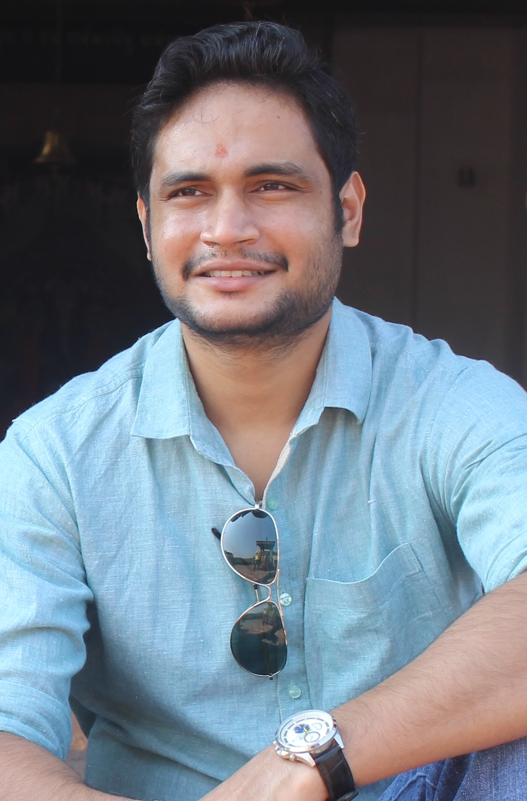

This is my Personal Website. Currently, I am a Postdoctoral Researcher in the group of Prof. Hendrik Ranocha at the Johannes Gutenberg University of Mainz, Mainz, Germany. 

# About Me

## Past Professional Experience
* Visting Faculty at the Department of Mathematics, IIT Madras, Chennai, India.
* Postdoctoral Reasearcher at TIFR-Center For Applicable Mathematics, Bangalore, India.
* Postdoctoral Reasearcher at Department of Physics, University of NotreDame, Indiana, USA.

## Education
* PhD in Mathematics from School of Mathematics, IISER-Thiruvananthapuram, Kerela, India.
* MS in Mathematics from School of Mathematics, IISER-Thiruvananthapuram, Kerela, India.
* Bsc in Mathematics and Computing from Institute of Mathematics and Application, Odisha, India. 

## Contact
* Room No. - 527, Staudingerweg 9
