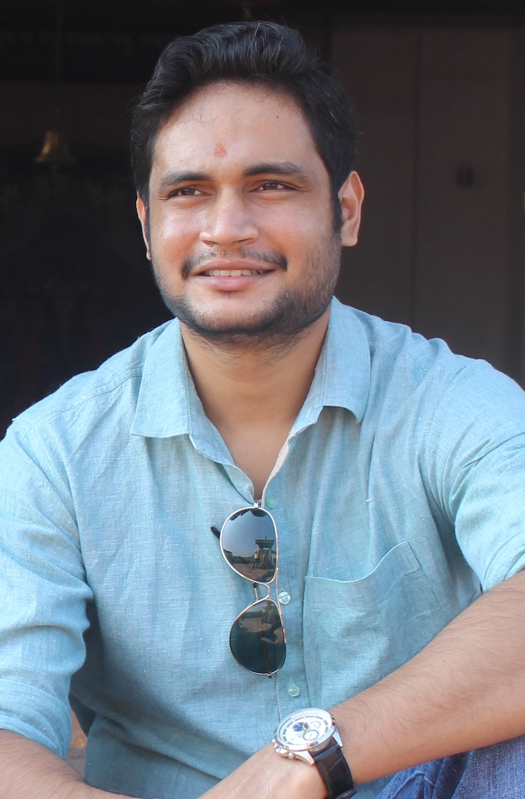

I am an Assistant Professor in Department of Mathematics, IIT Madras, Chennai, India. 

# About Me
I can think, I can wait, I can fast   -- Sidhartha

## Past Professional Experience
* Postdoctoral Researcher in Johannes Gutenberg University Mainz, Mainz, Germany. 
* Visting Faculty in Department of Mathematics, IIT Madras, Chennai, India.
* Postdoctoral Reasearcher in TIFR-Center For Applicable Mathematics, Bangalore, India.
* Postdoctoral Reasearcher in Department of Physics, University of NotreDame, Indiana, USA.

## Education
* PhD in Mathematics from School of Mathematics, IISER-Thiruvananthapuram, Kerela, India.
* MS in Mathematics from School of Mathematics, IISER-Thiruvananthapuram, Kerela, India.
* Bsc in Mathematics and Computing from Institute of Mathematics and Application, Odisha, India. 

## Contact
* Room No. - KCB-623B, IIT Madras.
